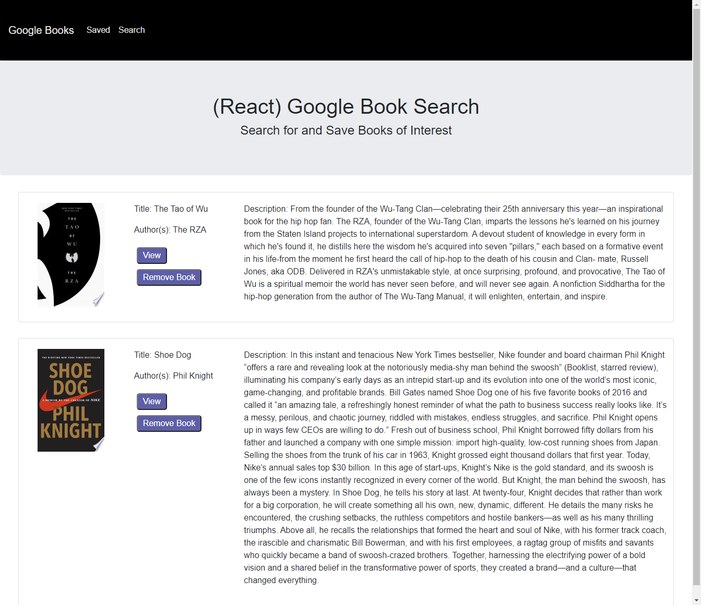
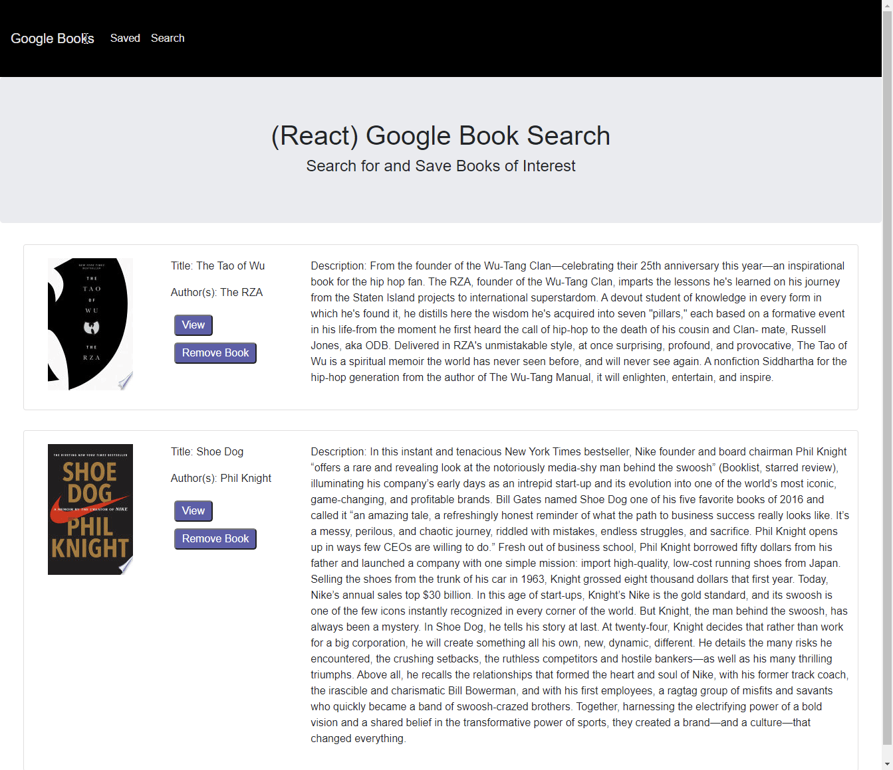

# Clicky Shoes

-----------------------
## Table of Contents
1. [Description](#description)
2. [Deployed link](#deployed-link)
3. [Code snippets](#code-snippets)
4. [Licenses](#licenses)
5. [Questions](#questions)

-----------------------
## Description
A clicky game made using JQuery. The object of the game is to not click on the same card picture more than once, otherwise it's game over! Each individual shoe card was rendered dynamically.



-----------------------
## Deployed link
[Link](https://warm-forest-76059.herokuapp.com/)

-----------------------
## Code snippets

```javascript
  handleInputChange = (event) => {
    event.preventDefault();
    var searchTerm = this.inputRef.current.value;

    console.log(searchTerm);

    API.google(searchTerm).then((res) => {
      console.log(res);
      var bookArray = res.data.items;
      bookArray.forEach((book) => {
        if (!book.volumeInfo.authors) {
          book.volumeInfo.authors = [];
        }
        if (!book.volumeInfo.imageLinks) {
          book.volumeInfo.imageLinks = {
            thumbnail: "",
          };
        }
      });
      this.setState({ bookArray: bookArray });
    });
  };
```
One of the many problems ran into while getting the functionality all working was that if specific books didn't contain a thumbnail image or author, it would throw an error and break the application. To nullify this problem, separate conditional statements are used where if these specific conditions aren't found then to leave the field's empty following the user inputted search. Although this was hard coded, it led to a cleaner aesthetic when the styling was added to the application.

-----------------------
## Licenses
This project uses a [MIT License](https://opensource.org/licenses/MIT). 

-----------------------
## Questions
Created by Michael Medina

If you have any questions you can reach me at the following: 


[michaelanthony.medinaa@gmail.com](mailto:michaelanthony.medinaa@gmail.com)  |[LinkedIn](https://www.linkedin.com/in/michaelanthonyy/) | [GitHub](https://github.com/michaelanthonyyy)  |

